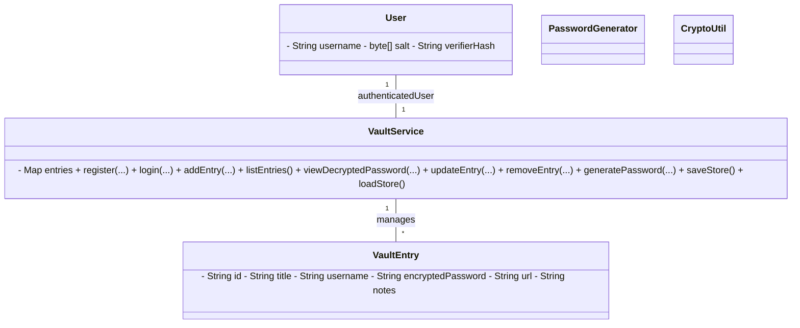

```mermaid
classDiagram
    class User { - String username - byte[] salt - String verifierHash }
    class VaultEntry { - String id - String title - String username - String encryptedPassword - String url - String notes }
    class VaultService { - Map<String, VaultEntry> entries + register(...) + login(...) + addEntry(...) + listEntries() + viewDecryptedPassword(...) + updateEntry(...) + removeEntry(...) + generatePassword(...) + saveStore() + loadStore() }
    class PasswordGenerator
    class CryptoUtil
    User "1" -- "1" VaultService : authenticatedUser
    VaultService "1" -- "*" VaultEntry : manages
```